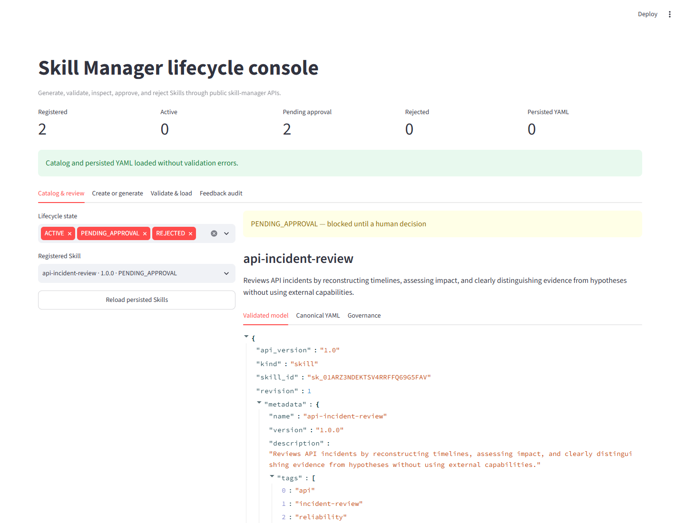
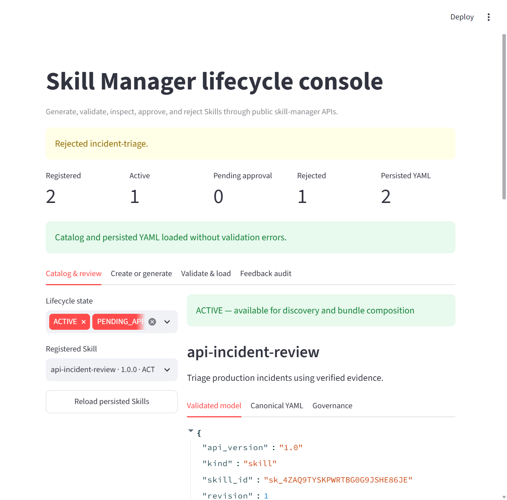
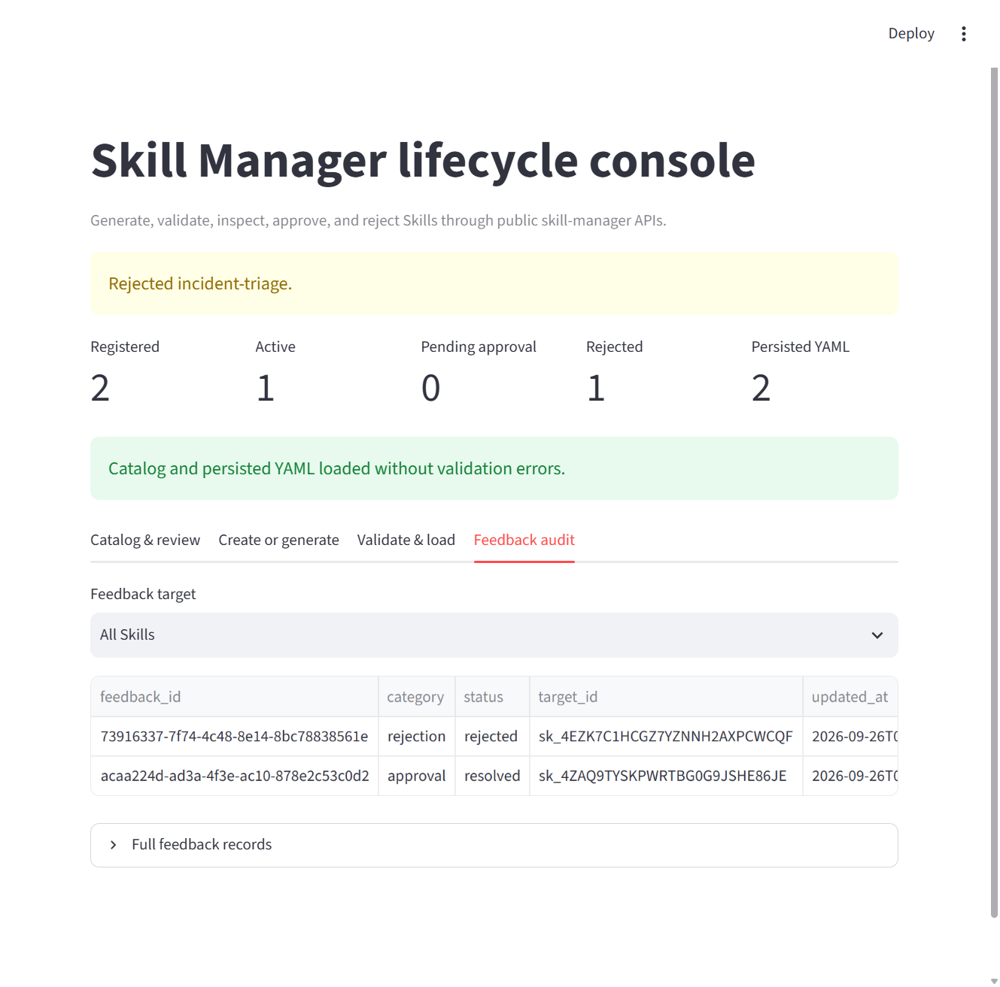

# Streamlit Skill lifecycle console

The Streamlit example is an application-owned review console built entirely
on public `skill-manager` and `feedback-manager` APIs. It provides a visual
way to verify that Skills:

- load from canonical YAML without validation errors
- remain blocked when an agent-created revision requires approval
- become discoverable only after a human approval
- retain explicit rejection feedback for a corrected revision
- round-trip through the validated Pydantic model and canonical YAML

Streamlit is optional UI infrastructure. It is not part of the Skill protocol
or an agent runtime.

## Public API excerpt

The console's review controls correspond to these public lifecycle calls.
This excerpt belongs inside an async review handler after a configured
manager has registered a pending agent-origin `candidate`:

```python
from skill_manager import SkillLifecycleState

pending = await manager.load(candidate.skill_id)
assert pending.lifecycle.state is SkillLifecycleState.PENDING_APPROVAL
approved = await manager.approve_skill(
    pending.skill_id,
    metadata={"reviewer": "skill-owner", "reason": "Instructions reviewed"},
)
print(approved.lifecycle.state.value)
```

The UI also offers rejection, source validation, and feedback audit. The
application is responsible for authenticating and authorizing reviewers.

## Install and run

Install the UI extra:

```console
uv sync --extra ui
```

Start the console:

```console
uv run --extra ui streamlit run examples/21_streamlit_skill_lifecycle.py
```

The default catalog directory is `skills/streamlit`. Override it when a
separate review environment is preferable:

```powershell
$env:SKILL_MANAGER_UI_SKILLS_DIR = "skills/my-review"
uv run --extra ui streamlit run examples/21_streamlit_skill_lifecycle.py
```

The example uses `FilesystemSkillSource` for canonical YAML and a compact
SQLite implementation of feedback-manager's public `FeedbackStore` contract.
Approval evidence therefore survives Streamlit reruns and process restarts.
Production applications should inject their own authorized source, registry,
and feedback store.

## Review a candidate

The **Create or generate** tab can create a deterministic manual candidate.
The candidate is registered as `PENDING_APPROVAL` and is not persisted until
a reviewer makes a decision.



The **Catalog & review** tab shows:

- validated model data
- canonical YAML
- provenance and governance metadata
- explicit approval and rejection controls
- source validation health and lifecycle counts

Approving a candidate records resolved approval feedback, moves the revision
to `ACTIVE`, and persists its YAML. Rejecting a candidate requires correction
text, records rejected feedback, moves the revision to `REJECTED`, and also
persists it for audit.



The **Feedback audit** tab reads the durable feedback events through
feedback-manager. It does not infer approval from mutable UI state.



## Verified result

The recorded UI walkthrough observed the following (these are UI states,
not stable terminal output):

| Action | Observed state |
| --- | --- |
| Create a manual agent candidate | `PENDING_APPROVAL`; unavailable to discovery |
| Approve after review | `ACTIVE`; canonical YAML persisted |
| Reject with correction notes | `REJECTED`; feedback available in the audit tab |
| Generate with a configured hosted model | `api-incident-review` remained `PENDING_APPROVAL` until a reviewer decision |

The screenshots above show the pending review, catalog decisions, and
feedback audit from that walkthrough. The live model result depends on
provider availability and may vary; the hosted-model run was not repeated
for this documentation update.

## Generate with a real model

Live generation is optional and requires the OpenAI-compatible integration:

```powershell
# Configure EXPLABS_API_KEY through your environment or secrets manager first.
uv run --extra ui --extra openai-compatible streamlit run `
  examples/21_streamlit_skill_lifecycle.py
```

The application reads its provider credential from the process environment;
keep the value out of command history, screenshots, and Skill YAML. The
application passes the model directly to `SkillManager.generate_skill`. The
same canonical `Skill` schema used for human-authored YAML validates the
model result.

The hosted model verification produced `api-incident-review` and left it in
`PENDING_APPROVAL`. Its first structured response contained a human-readable
identifier rather than a canonical immutable Skill ID. The example's explicit
`repair_generator` corrected that single structured-output validation failure;
the repaired result was validated before any registry mutation. Applications
that do not opt into repair continue to receive the validation error.

## Validate and import YAML

Paste a document into **Validate & load**:

- **Validate only** parses YAML safely and validates the canonical model
  without mutating the catalog.
- **Validate and register** validates first, then registers and persists the
  Skill through the configured source.

Malformed YAML, schema violations, duplicate identities, and source failures
are displayed as errors rather than converted into success-shaped defaults.

## Persistence and security boundaries

- Agent candidates are not written to disk before a human decision.
- Approved and rejected revisions are canonical YAML documents.
- Approval and rejection evidence is stored in `feedback.sqlite3` beside the
  example catalog.
- The UI never executes Skill instructions.
- Application authorization, deployment authentication, and production
  database policy remain application responsibilities.
- The dashboard exposes lifecycle state and validated metadata rather than
  application implementation details.

For non-visual review flows, see the
[approval example](approval.md), [rejection feedback](rejection-feedback.md),
and [catalog lifecycle views](catalog-views.md).
